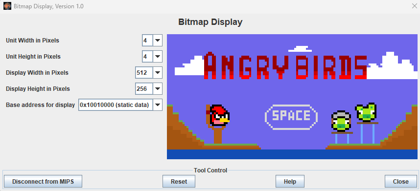
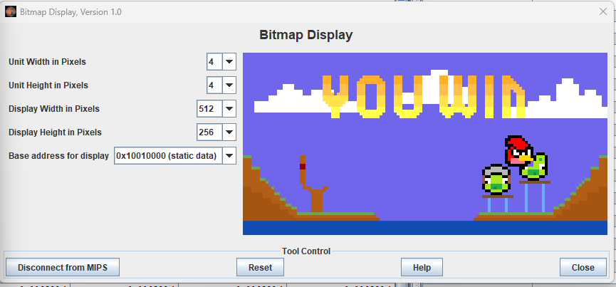
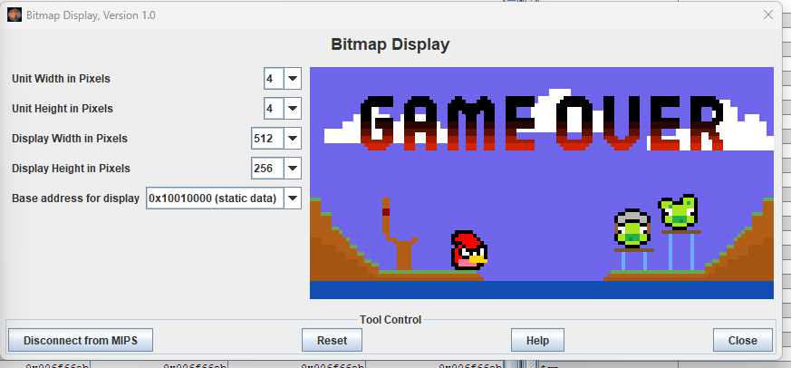

# Angry-Birds

Esta é uma implementação em linguagem Assembly do clássico jogo Angry Birds, desenvolvida  
em colaboração com Carol Azevedo. Construímos este projeto usando o simulador MARS MIPS  
como parte da nossa disciplina de Arquitetura de Computadores.
 

## JOGO
### Tela inicial do jogo  
Ao clicar na tecla "Space"(Espaço) o jogo começa.  
 

 
Utilizando as teclas abaixo é possível controlar a direção em que o passáro voará:  
 
"w" - Para cima  
"D" - Reto  
"S" - Para baixo  

### Tela de vitória

### Tela de derrota

